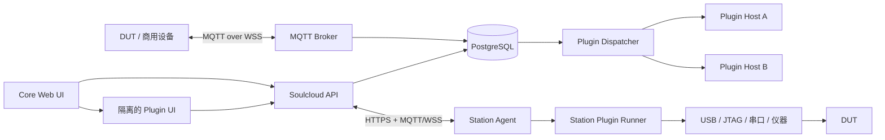

# 插件、工业 Entity 与工位执行架构规划

**状态**：设计提案，尚未实施  
**日期**：2026-08-21

本文规划 SoulcloudJS 面向商用设备、生产测试和烧录治具的插件能力。目标类似
Home Assistant/Mi Home 的设备集成体验，但不照搬面向民用智能家居的 Entity
分类、自动化模型或运行时插件市场。

当前已经确定：

- 插件均由可信团队开发，暂不支持运行时安装；插件随 Soulcloud 版本构建和部署。
- “可信”不等于“不会出错”。必须隔离插件崩溃、死循环、OOM、资源泄漏、输入触发的
  DoS 和越权数据访问，插件不得带崩 API、MQTT broker 或其他插件。
- 工位只建立出站连接；云端不得直接访问工位的 USB、JTAG、串口或局域网仪器。
- 工位环境可能是 Linux/Windows PC、Raspberry Pi/Intel Atom 级工控机，也可能是
  ESP32/CH32V4 级可联网 MCU。
- 外部合作伙伴、企业防火墙、国际漫游 4G SIM 和复杂跨境链路均属于正常部署环境。
- 线上业务传输只使用常见、可识别、便于审批的 TLS 协议；不把 ICMP payload、DNS
  tunnel 或其他隐蔽通道作为业务协议。

## 1. 总体架构



设计原则：

- API 和 broker 的热路径不加载、调用或等待插件代码。
- PostgreSQL 继续承担 durable queue、lease 和状态持久化；`LISTEN/NOTIFY` 或
  MQTT 通知只降低延迟，不承担正确性。
- 云端插件在独立进程或容器中运行；工位插件在独立 runner 中运行。
- 插件只通过有范围限制的 SDK/RPC 使用核心能力，不得到 Prisma client、数据库凭据、
  用户 JWT 或全局环境变量。
- 默认 UI 是声明式的；特殊 UI 使用隔离 bundle，而不是加载到主 React tree。

## 2. 插件发布和目录

第一版采用编译期插件注册：

```text
packages/
  plugin-sdk/
  plugin-dispatcher/
  station-agent/
  plugin-ui/

plugins/
  generic-device/
  espressif-flash-fixture/
  factory-functional-test/
  mes-connector/
  registry.ts
```

单个插件按运行边界拆分入口：

```text
plugins/espressif-flash-fixture/
  manifest.ts       纯数据；可由核心服务读取
  profiles.ts       设备 profile、Entity、Action 描述
  worker.ts         云端 Plugin Host 逻辑
  station.ts        PC 工位 runner 逻辑
  embedded/         MCU 工位的静态编译实现
  web.tsx           可选的隔离 UI 入口
  translations/
  tests/
```

插件通过显式、类型安全的 registry 注册，不在生产环境扫描目录、安装 npm 包或远程加载
未知模块：

```ts
export const plugins = [
  genericDevicePlugin,
  espressifFlashFixturePlugin,
] as const;
```

每个插件声明稳定的 `id`、插件版本和 SDK API 版本：

```ts
definePlugin({
  id: "espressif.flash_fixture",
  version: "1.0.0",
  apiVersion: 1,
  profiles: [],
  entities: [],
  actions: [],
  workflows: [],
  events: [],
  ui: {},
});
```

## 3. Plugin Installation 与 Device Profile

插件代码存在不代表每个项目都启用它。一个项目可以配置多个 installation，例如不同工厂、
产线或 MES 环境：

```text
plugin_installations
  id
  project_id
  plugin_id
  configured_plugin_version
  state                 enabled | draining | disabled | error
  config_json
  created_at
  updated_at
```

配置保存在数据库；部署级 secret 可以引用环境变量或 secret provider：

```json
{
  "mes_endpoint": "env:MES_FACTORY_A_URL",
  "product_line": "line-3"
}
```

一个插件可以定义多个 Device Profile：

```ts
{
  id: "esp32s3_fixture_v2",
  version: 3,
  manufacturer: "Internal",
  model: "ESP32-S3 Production Fixture",
  capabilities: ["flash", "erase", "read_mac", "functional_test"],
  configurationSchema: {},
}
```

设备绑定以下稳定身份：

- `plugin_installation_id`
- `plugin_id`
- `profile_id`
- `profile_version`
- `configuration JSONB`

既有设备迁移为内置 `soulcloud.generic` profile，保持现有命令、MQTT、日志和 OTA
协议兼容。已投产设备固定 profile 版本，插件升级不得静默改变其中途行为。

## 4. 工业化 Entity 模型

借鉴 Home Assistant 的核心思想：Device 表示物理设备，Entity 表示设备提供的稳定逻辑
端点；Entity 有唯一身份、当前状态、可用性和标准化操作。但不复制 `light`、`switch`、
`climate` 等民用 domain。

建议的描述结构：

```ts
interface EntityDescriptor {
  key: string;
  valueType: "number" | "boolean" | "string" | "enum" | "binary";
  access: "read" | "write" | "read_write";
  category:
    | "primary"
    | "diagnostic"
    | "configuration"
    | "measurement"
    | "counter";
  unit?: string;
  enumValues?: string[];
  staleAfterSeconds?: number;
  history?: "none" | "changes" | "sampled" | "all";
}
```

Entity 唯一身份由系统生成：

```text
(plugin_id, device_id, entity_key)
```

工业状态还需要质量、来源时间和告警：

```ts
interface EntityState {
  value: unknown;
  quality: "good" | "bad" | "uncertain" | "stale" | "unknown";
  sourceTimestamp?: string;
  ingestedAt: string;
  sequence?: bigint;
  alarm?: {
    level: "info" | "warning" | "critical";
    code: string;
  };
}
```

必须区分以下概念：

| 数据 | 建模方式 |
| --- | --- |
| 治具电压当前值 | Entity |
| 产品累计烧录次数 | Entity/counter |
| 本次测试测得 3.301 V | Measurement |
| DUT 过压告警 | Event + Entity alarm state |
| 一次完整烧录和功能测试 | Workflow/Job |
| esptool/OpenOCD 输出 | Job artifact/log |

当前状态和历史分开存储：

```text
entity_registry
entity_current_state
entity_history
```

高频状态必须按 descriptor 的 retention policy 限流/采样；生产 Measurement 通常完整保留，
因为它属于质量追溯记录。

## 5. Action、Event 与现有设备协议

Action 表示用户可执行的操作，例如 `read_mac`、`factory_reset`、`set_serial_number`、
`run_self_test`。简单 Action 应转换为现有 `DeviceCommand`，复用当前 durable command
queue，不为每个插件新增 MQTT topic。

设备需要发送插件专用数据时，增加一个通用上行 envelope：

```text
soulcloud/v1/devices/{uid}/event
```

```ts
{
  plugin: "vendor.device_family",
  schema: 1,
  kind: "functional_test_result",
  data: unknown,
}
```

Broker 只执行 ACL、大小/速率限制、基础 envelope 校验和持久化；具体解码交给 Plugin
Host。普通日志继续走 `/log`，状态继续走 `/stat`，OTA 和 command 协议保持不变。

## 6. 云端插件故障隔离

### 6.1 Core API

Core API 负责用户认证、project membership、限流、请求体限制、installation 管理、
Entity registry、job 创建和插件输出校验。

Core API 不允许插件：

- 注册原始 Elysia route。
- 访问 Prisma client 或数据库连接串。
- 接收用户 JWT 或全局应用 secret。
- 在 HTTP 请求热路径中无限期执行。

复杂插件请求优先转为异步 operation；确实需要同步 RPC 时必须设置 deadline、response
size limit 和 circuit breaker，插件不可用时返回明确的 `503`，而不是拖垮 API。

### 6.2 MQTT Broker

Broker 不调用 Plugin Host，也不执行插件 parser。它只将通过通用校验的数据写入 durable
inbox/outbox。这样插件死循环、OOM 或外部服务超时不会影响设备 MQTT 会话。

### 6.3 Plugin Dispatcher

Dispatcher 是不加载插件代码的可信核心进程，负责：

- 从 PostgreSQL lease 插件事件。
- 按 `plugin_id` 路由到独立 Plugin Host。
- timeout、取消、重试和 dead-letter。
- 限制请求/响应字节数和更新数量。
- 校验插件输出并提交给核心服务。

建议的数据模型：

```text
plugin_events
  id
  plugin_installation_id
  device_id
  event_kind
  schema_version
  payload
  state                 pending | leased | completed | failed | dead
  attempt_count
  available_at
  lease_expires_at
  idempotency_key
```

实现沿用现有 command queue：`FOR UPDATE SKIP LOCKED`、lease 超时恢复、幂等处理、
指数退避，`LISTEN/NOTIFY` 仅作唤醒。

### 6.4 Plugin Host

生产环境按插件 ID 运行独立进程或容器：

```text
plugin-host-espressif
plugin-host-mes
plugin-host-functional-test
```

同一插件的多个 project installation 可以共享一个 host；不同插件不共享进程。每个 host
具有独立 CPU、RSS、PID、并发、日志和重启限制，只注入自己的配置和 secret。

插件通过有作用域的 SDK 工作：

```ts
interface PluginContext {
  installation: {
    id: string;
    projectId: string;
    config: unknown;
  };
  devices: ScopedDeviceService;
  commands: ScopedCommandService;
  entities: ScopedEntityService;
  jobs: ScopedJobService;
  logger: PluginLogger;
  signal: AbortSignal;
}
```

SDK 已绑定 `pluginInstallationId + projectId`，插件不能指定其他 project。即使插件存在
SQL injection 类 bug，进程中也没有数据库连接可被利用。

## 7. 前端插件隔离

### 7.1 默认：声明式 UI

插件优先只声明：

- Entity 卡片、表格和曲线。
- Action 表单。
- Workflow 参数表单。
- Measurement 表格。
- Job timeline。
- 设备详情 tab 和导航项。

由 Soulcloud 核心 React 组件渲染，不执行插件前端代码。

### 7.2 高级：隔离 Plugin UI

声明式组件无法表达时，插件提供独立 Vite entry/bundle，通过 iframe 加载：

- 不 `import()` 到主 React tree。
- 使用版本化 `postMessage` SDK。
- 外层提供 timeout、错误页和重新加载。
- 不接收主站 JWT；核心 API 签发短期、限定 plugin/project 的 session token。
- 优先使用独立 origin，隔离 DOM、CSS、路由和数据权限。

`ErrorBoundary` 只能捕获异常，无法阻止死循环冻结主线程，因此不能作为唯一隔离手段。
插件暂不支持运行时安装，但其 UI bundle 仍应在构建和部署时独立生成。

## 8. Station Agent 的定义

Station Agent 是一个“工位角色和协议”，不是特定可执行文件，也不是被生产的 DUT 固件。

| 角色 | 定义 | 职责 |
| --- | --- | --- |
| Device/DUT | 最终出厂产品 | 运行产品固件，通过设备 MQTT 协议连接 Soulcloud |
| Fixture controller | 治具 MCU/控制板 | 控制继电器、电源、探针等本地硬件 |
| Station Agent | 工位控制端 | 领取 job、控制 runner/治具、上传过程与结果 |

### 8.1 Full Station Agent

适用于 Linux/Windows PC、Raspberry Pi、Intel Atom 工控机：

- 作为 daemon/service 运行。
- Linux 使用 systemd/cgroup；Windows 使用 Service/Job Object。
- agent 核心与插件 runner 分进程。
- 支持 esptool、OpenOCD、厂商 CLI、USB/JTAG/串口和网络仪器。
- runner 崩溃、OOM 或超时后 agent 仍能上传失败、释放 lease 并继续接任务。

### 8.2 Embedded Station Agent

适用于 ESP32/CH32V4 级联网 MCU：

- 插件驱动静态编译进固件，不支持运行时安装。
- 使用 watchdog、有界队列和静态/初始化阶段内存分配。
- 业务 task 必须正常阻塞/让出调度，避免触发 task watchdog。
- job ID、步骤、sequence 和结果持久化，重启后可恢复或明确终止 attempt。
- 单个插件 bug 最多导致该 station 重启，不得影响云端或其他 station。

MCU 没有进程级隔离，因此不能承诺“插件不影响 agent 固件”；隔离边界是单台 station。

### 8.3 统一能力声明

两类 agent 使用同一应用语义，但声明不同能力：

```ts
interface StationCapabilities {
  agentClass: "full" | "embedded";
  platform: "linux" | "windows" | "mcu";
  transports: Array<"https" | "mqtt-wss">;
  executors: string[];
  maxArtifactBytes: number;
  maxEventBytes: number;
  maxConcurrentJobs: number;
  supportsHttpRange: boolean;
  supportsProcessIsolation: boolean;
}
```

调度器只能把 workflow 分配给能力匹配的 station。

## 9. 工位 Workflow 与生产追溯

烧录治具应建模为 durable workflow，而不是一个长时间普通 command：

```text
queued
  → claimed
  → running
      → detect_target
      → read_chip_id
      → erase
      → flash
      → verify_hash
      → provision_identity
      → functional_test
      → print_label
  → succeeded | failed | cancelled
```

建议核心表：

- `fixture_stations`
- `fixture_jobs`
- `fixture_job_attempts`
- `fixture_job_steps`
- `fixture_measurements`
- `fixture_artifacts`
- `fixture_resource_leases`

每个 job 快照保存：

- plugin/profile ID 和版本。
- 固件 SHA-256、ELF build ID。
- station、agent、runner 和工具版本。
- 操作员、产品序列号、芯片 MAC。
- 每一步开始/结束时间和重试。
- 测量值、单位、上下限和判定。
- 完整日志、失败原因和产物。

正在运行的 job 固定插件和 profile 版本，升级不得改变其中途语义。

### 9.1 工位资源锁

插件声明本地独占资源：

```ts
resources: [
  { type: "serial", id: "/dev/ttyUSB0", exclusive: true },
  { type: "jtag", id: "probe-01", exclusive: true },
  { type: "relay-board", id: "relay-a", exclusive: true },
]
```

资源锁带 lease；agent 崩溃后可以恢复。一个串口、探针或治具不能被两个 job 同时使用。

## 10. Station 网络协议

Station Protocol 与传输层解耦，但第一版只要求两种常见协议：

1. HTTPS/1.1：所有 station 必须支持，是正确性通道。
2. MQTT 3.1.1 over WSS：可选，是实时通知通道。

不再为 station 设计第三套裸 WebSocket 业务协议。所有连接由 station 主动向外建立，默认
使用正常域名、TLS、SNI 和端口 443，不要求合作伙伴开放入站端口。

### 10.1 HTTPS 正确性通道

通过 HTTPS 完成：

- 注册和凭据轮换。
- 原子领取 job 和续租。
- 获取 workflow。
- artifact/firmware 下载和 HTTP Range 续传。
- 批量上传 measurement、事件和日志。
- 完成/失败/取消任务。

所有修改请求使用幂等 key；重复上传和重试不得生成重复结果。

### 10.2 MQTT/WSS 通知通道

MQTT/WSS 用于：

- `job_available`
- `job_cancelled`
- 小型进度通知
- station 在线状态和低频 heartbeat

收到 `job_available` 后仍通过 HTTPS claim job。MQTT 通知丢失时，HTTPS 的周期性
`lease-next` 仍能发现任务。

### 10.3 企业代理和 TLS

Station 实现应支持：

- HTTP CONNECT proxy。
- 系统 CA 和管理员配置的企业 CA。
- IPv4/IPv6 双栈和 CGNAT。
- 可配置的地区 endpoint。
- WSS 失败时自动切换 HTTPS long-poll/periodic poll。

不默认 pin 叶证书，避免企业 TLS inspection 和正常证书轮换造成断网；不得通过关闭证书
校验解决企业 CA 问题。

### 10.4 重连

使用带随机 jitter 的指数退避，例如：

```text
1s → 2s → 5s → 10s → 30s → 1min → 5min
```

不得无限快速重连，避免工厂网络恢复时形成 reconnect storm。心跳和最大退避均由
sysadmin 配置，不硬编码为协议常量。

## 11. 国际漫游与弱网优化

提供至少三种网络 profile：

```text
lan
metered
roaming
```

`metered/roaming` 模式要求：

- 有业务流量时不额外发送 heartbeat。
- 合并 progress、measurement 和日志上传。
- 使用持久 HTTP keep-alive，避免频繁 TLS handshake。
- artifact 支持 Range、断点续传和 SHA-256 校验。
- 上传带 sequence 和 cumulative ACK。
- 使用有界本地 spool，断网后逐步补传。
- 心跳不进入 spool，不补发过期 heartbeat。
- spool 满时优先丢弃 debug log；job result/measurement 不得丢。

日志按大小、时间或 job 完成条件成批上传。MCU 优先使用有界 MessagePack 批次；PC 只有
在达到合理大小后才压缩，避免小包压缩反而增加 CPU 和延迟。

## 12. ICMP Payload 决策

不使用 ICMP payload 传输生产 heartbeat、遥测或日志，原因包括：

- 企业防火墙和运营商可能过滤或 rate-limit ICMP Echo。
- CDN、HTTP 反向代理和常规云负载均衡不会把 ICMP 转发给应用服务。
- Linux 容器通常需要 raw socket capability；Windows/Linux API 和权限不同。
- ICMP 不提供业务认证、加密、可靠交付、拥塞控制和重放保护。
- 补齐 sequence、ACK、加密和重试后等于在 ICMP 上重新造传输协议。
- 持续携带业务 payload 容易被 IDS 识别为 ICMP tunnel，也难以通过合作伙伴安全审批。
- 日志的体积和频率尤其不适合 ICMP。

ICMP 仅用于可选的标准网络诊断，例如人工触发的 ping、RTT 和丢包测量；payload 不含
station ID、状态、日志或其他业务数据，也不能作为在线状态的唯一依据。

复杂跨境链路应通过标准 HTTPS/WSS 443、正常证书和可配置区域 ingress 解决，而不是
使用 ICMP/DNS tunnel、自定义 TLS 或协议伪装。

## 13. Station 端插件隔离

Full Station Agent 保持小型和稳定，runner 通过受控 IPC 工作：

```text
station-agent
  └── spawn/IPC
      └── station-plugin-runner
          ├── esptool/OpenOCD
          ├── serial
          └── instruments
```

Agent 对 runner 施加：

- job deadline 和空闲超时。
- 最大 RSS、子进程数和日志大小。
- kill/cancel。
- 独立工作目录。
- stdout/stderr 捕获。
- USB/JTAG/串口资源 lease。

Runner 崩溃时 agent 不退出，而是上传已有日志、标记 attempt 失败、释放资源，并根据
workflow policy 判断是否重试。

## 14. 数据流和权限边界

云端插件不得直连 station：

```text
Plugin Host
  → 创建 workflow/job
  → Core API/PostgreSQL
  → Station Gateway
  → HTTPS 或 MQTT/WSS
  → Station Agent
  → IPC
  → Station Plugin Runner
```

反向数据同样经过核心校验：

```text
Plugin Runner 输出
  → Station Agent 限流、校验、批处理
  → Core Station API
  → durable event
  → Plugin Dispatcher
  → Plugin Host
```

该边界同时限制云端插件 bug、station runner bug、畸形输入、重连风暴、日志洪泛和单个
project 的资源滥用。

## 15. 性能约束

- Broker 不同步调用插件，也不对每个 MQTT packet 遍历所有插件。
- `(pluginId, profileId, eventKind)` 使用预建 Map 查找。
- JSONB 仅存低频配置和插件附加字段；高频 measurement 使用有类型列。
- outbox 批量 lease、批量完成，每插件独立 concurrency。
- 高频普通日志默认不触发 Plugin Host hook。
- 所有慢 hook 接收 `AbortSignal` 和 deadline。
- 每次插件调用限制输入、输出、Entity update 和 artifact 数量/大小。
- Web 插件 bundle 独立加载；声明式 UI 不引入插件 JavaScript。
- Embedded Agent 使用固定上限 buffer、队列和 spool，不允许无界累积。

## 16. API 草案

插件控制面：

```text
GET    /v1/plugins/catalog
GET    /v1/projects/:id/plugin-installations
POST   /v1/projects/:id/plugin-installations
PATCH  /v1/plugin-installations/:id
POST   /v1/plugin-installations/:id/disable
```

设备插件：

```text
PUT    /v1/devices/:id/profile
GET    /v1/devices/:id/plugin-view
GET    /v1/devices/:id/actions
POST   /v1/devices/:id/actions/:action_id
```

工位：

```text
POST   /v1/stations/register
POST   /v1/stations/:id/lease-next
POST   /v1/stations/:id/jobs/:job_id/heartbeat
POST   /v1/stations/:id/jobs/:job_id/events
POST   /v1/stations/:id/jobs/:job_id/complete

POST   /v1/fixture-jobs
GET    /v1/fixture-jobs/:id
POST   /v1/fixture-jobs/:id/cancel
```

## 17. 实施顺序

### 阶段 1：架构与 SDK 骨架

- 确定 Plugin SDK、Station Protocol 和版本兼容规则。
- 建立静态 manifest registry。
- 实现工业 Entity descriptor/current state 模型。
- 现有设备映射为 `soulcloud.generic`，不改变协议行为。

### 阶段 2：插件进程隔离原型

- 实现 Dispatcher 与独立 Plugin Host RPC。
- Plugin Host 不持有数据库连接或用户 JWT。
- 加入 timeout、response size、concurrency、retry、dead-letter 和 circuit breaker。
- 使用故意 crash、死循环、OOM 倾向和超大响应的测试插件验证 API/broker 不受影响。

### 阶段 3：Action 与声明式 Web UI

- 插件 Action 转换为现有 command queue。
- Web 根据 schema 渲染 Action/Entity 表单和状态。
- 实现短期 plugin UI session；必要时加入 iframe UI。

### 阶段 4：HTTPS Station 正确性路径

- 实现 station 注册、能力、job lease、heartbeat、progress 和 complete。
- 实现 Linux reference agent 和受控 runner 子进程。
- 实现 resource lease、断网恢复和本地 spool。

### 阶段 5：实时和弱网支持

- 增加 MQTT/WSS job notification。
- 保留 HTTPS polling fallback。
- 实现 metered/roaming profile、批处理、Range 下载和 cumulative ACK。
- 在企业 proxy、TLS inspection、CGNAT、弱网和国际漫游 SIM 上做网络矩阵测试。

### 阶段 6：Embedded Station Agent

- 抽取使用有界缓冲、业务运行期避免动态分配的嵌入式 Station Client SDK。
- 先实现 ESP32 reference agent，再移植到 CH32V4 级平台。
- 验证 watchdog、掉电恢复、spool 上限和重复 job 幂等性。

### 阶段 7：首个真实插件

使用 `espressif-flash-fixture` 验证完整设计：

- 芯片和 profile 探测。
- bootloader/partition/app 烧录。
- SHA-256 校验。
- MAC/序列号读取和 NVS provisioning。
- 串口功能测试。
- 测量、日志和生产结果上传。
- Linux runner 与 MCU embedded 两种执行路径。

真实流程应先于抽象 API 的最终冻结；假的 hello-world 插件不足以暴露烧录、仪器、资源锁、
断网恢复和生产追溯的实际需求。

## 18. 参考资料

- [Home Assistant：设备与服务集成架构](https://developers.home-assistant.io/docs/architecture/devices-and-services/)
- [Home Assistant：Device Registry](https://developers.home-assistant.io/docs/device_registry_index/)
- [Home Assistant：Custom Panels](https://developers.home-assistant.io/docs/frontend/custom-ui/creating-custom-panels/)
- [RFC 6455：WebSocket Protocol](https://www.rfc-editor.org/info/rfc6455/)
- [MQTT 3.1.1：WebSocket Transport](https://docs.oasis-open.org/mqtt/mqtt/v3.1.1/cos02/mqtt-v3.1.1-cos02.html)
- [RFC 4890：ICMPv6 Firewall Filtering](https://www.rfc-editor.org/info/rfc4890/)
- [RFC 3871：Operational Security Requirements](https://www.rfc-editor.org/rfc/rfc3871.html)
