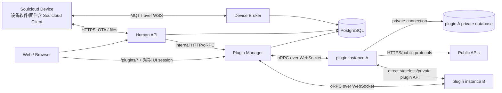

# Soulcloud 插件架构与需求

**状态**：目标架构；服务端基础纵切已实现，未完成项以实施计划为准
**日期**：2026-08-25

本文定义 Soulcloud 的设备侧扩展、云端插件、Plugin Manager、设备 MQTT 事件和插件 SSR UI。
此前文档中的 Station、Station Agent、Station Plugin、Fixture Plugin、workflow 和工位专用
协议全部废弃；实现时直接删除，不提供兼容 alias、旧路由或双协议回退。

## 1. 术语

| 名称 | 定义 |
| --- | --- |
| Soulcloud Device | 任何连接 Soulcloud 的边缘设备，包括 MCU、产品设备、烧录治具、Linux/Windows PC 和工控机 |
| Soulcloud Client | 运行在 Soulcloud Device 上的软件或固件 |
| Device Broker | 现有设备 MQTT/WSS broker；所有 Device MQTT 流量只能经过它 |
| Human API | 面向浏览器、用户和普通 API 客户端的 API Server，仍是用户权限判定权威 |
| Plugin Manager | 独立部署的 Bun 服务，负责插件注册、路由、RPC、事件消费、校验和插件 SSR 路由 |
| plugin | 可信但可能有 bug 的云端扩展代码 |
| plugin instance | plugin 的一个运行实例；只有需要区别部署实例时使用该称呼 |
| plugin installation | 某个 project 对一个指定 plugin/version 的启用和配置 |

不再使用以下名称：

- Station、Station Agent、Station Runtime、Station Gateway；
- Fixture Plugin、Station Plugin；
- Plugin Host、Plugin Dispatcher；
- workflow、step executor 或工位编排器。

## 2. 总体拓扑



硬边界：

- Soulcloud Device 不运行 plugin、容器、RPC runtime 或 workflow engine。
- plugin 只运行在云端自己的容器中，不运行在 Soulcloud Device 上。
- plugin 不能连接 Device Broker、Soulcloud Device、Soulcloud PostgreSQL 或 USB/JTAG/串口硬件。
- plugin 可以连接由自身部署独占、凭据和 schema 均与 Soulcloud 分离的私有数据库；Plugin
  Manager 不读取或管理其中的产品业务数据。
- Device Broker 不调用 Plugin Manager 或 plugin；它先持久化设备事件，再返回 MQTT ACK。
- Human API、Device Broker、Plugin Manager 和每个 plugin instance 是独立部署与故障域。
- Docker Compose、systemd 或 Kubernetes 管理进程和容器生命周期。Soulcloud 代码不 spawn、
  kill、restart 容器，也不访问 Docker socket。

## 3. Soulcloud Device 与 Soulcloud Client

> **术语约束**：不要写“低层 SWD/UART 留在 Client”。准确表述是：低层 SWD/UART
> 由 Soulcloud Device（例如 SoulInjector 设备）的本地设备软件/固件执行；Soulcloud Client
> 仅负责 MQTT/HTTPS 等 Soulcloud 云端通信。

所有边缘硬件和边缘计算机统一称为 Soulcloud Device；Soulcloud Client 只表示运行在设备上的
软件/固件组件，不是设备本身的别名。设备用途和体积不产生新的身份域或协议。例如运行烧录治具
的 PC 是 Soulcloud Device；它通过本地 USB/JTAG 操作的目标板只是本地外设，除非目标板自己
联网并运行 Soulcloud Client。

设备能力直接实现并编译进设备软件/固件。例如治具设备可以实现：

```text
erase_flash
flash_firmware
verify_flash
read_mac
run_functional_test
```

云端 plugin 只能调用设备已实现的 DeviceCommand。部署 plugin 不能向设备动态注入代码；
增加硬件能力需要发布新的设备软件/固件。`Soulcloud Client` 是设备上的 Soulcloud 通信软件
或固件组件名称，不用来代指执行硬件操作的设备本身。

对于带调试/测试硬件的设备，USB/JTAG/SWD/UART 的低层协议、时序、轮询、重试和硬件状态
管理由 Soulcloud Device 本地的设备软件或固件执行；云端只下发设备已实现的、有界
DeviceCommand。设备软件/固件中可以包含 Soulcloud Client 通信组件，但“设备”是硬件执行主体，
“Soulcloud Client”不是设备的另一种称呼，也不是独立的 Station 或 Agent 系统角色。

低层 SWD/UART 归属于 Soulcloud Device 的本地设备软件/固件；其中负责 MQTT/HTTPS 通信的
那部分才叫 Soulcloud Client。即使设备软件把通信和硬件驱动编译在同一个程序里，两者的术语
和职责仍然分开，文档、API 和权限模型都不得把 Client 当作设备身份。

设备侧要求：

- MQTT 必须走现有 Device Broker，默认 MQTT over WSS；
- OTA、固件和大型文件使用 HTTPS；
- 不为插件建立额外 socket、RPC 或直连通道；
- MCU 使用有界 buffer/queue，业务运行期尽量避免 heap allocation；
- QoS 1 消息必须支持幂等和重投递；
- 不允许无界日志、event batch 或文件驻留内存。

## 4. Device MQTT 协议

保留现有 topic：

```text
平台 → Device
soulcloud/v1/devices/{uid}/cmd/exec
soulcloud/v1/devices/{uid}/ota

Device → 平台
soulcloud/v1/devices/{uid}/cmd/result
soulcloud/v1/devices/{uid}/stat
soulcloud/v1/devices/{uid}/log
```

新增唯一的通用插件上行 topic：

```text
soulcloud/v1/devices/{uid}/event
```

### 4.1 `/event` 的职责

用于不属于固定 `/stat`、普通日志或某条 command result 的结构化上行数据，例如：

- 设备主动检测到的业务事件；
- 治具测试结果；
- 插件定义的 telemetry/entity update source；
- 告警、校准结果和外设状态变化。

第一版 envelope 已固定为一个严格 MessagePack map：`id` 是 16-byte bin，`seq` 是 uint64，
`kind` 是最多 128 UTF-8 bytes 的非空字符串，`schema` 是正的 int32，`data` 必须存在。禁止
unknown/duplicate/missing field 和 trailing bytes：

```ts
interface DeviceEventEnvelope {
  id: Uint8Array;
  seq: bigint;
  kind: string;
  schema: number;
  data: unknown;
}
```

设备端是否必须将 `seq` 跨掉电持久化仍需结合 flash 磨损和设备幂等存储方案确认；
这不改变 wire format，也不能用随机重置序号替代 `id` 幂等。

协议规则：

- Device 不发送 `plugin_id`、installation ID 或 project ID；
- Broker 从认证身份得到 device，再由数据库绑定决定 plugin/profile/version；
- 使用 QoS 1，按 `(device_id, id)` 幂等，`seq` 用于排序和缺口诊断；
- envelope、字符串、嵌套深度、数组和 binary 总字节均有硬上限；
- 高频数据先使用有界 batch event，不预先增加 `/telemetry` topic；
- Broker 只校验通用 envelope、ACL、大小和速率，不解析 plugin payload；
- 普通 `/stat`、`/log` 和 `/cmd/result` 不触发 plugin，除非未来有明确需求。

### 4.2 下行与结果

plugin Action 继续编码为现有 DeviceCommand，通过 `/cmd/exec` 下发，并由 `/cmd/result` 返回。
不增加 `/plugin/*`、`/station/*` 或 plugin-specific MQTT topic。

### 4.3 文件和 OTA

MQTT 只传文件引用：

```ts
interface FileReference {
  id: string;
  sha256: string;
  size: number;
  kind: string;
}
```

正文通过 HTTPS 上传/下载。URL 或 token 必须绑定 device/file/operation、短期有效且不可作为
长期凭据；设备校验长度和 SHA-256。达到真实需求时支持 HTTP Range，不使用 MQTT 分块传
大文件。

## 5. Plugin Manager

Plugin Manager 是独立 Bun 服务，不嵌入 Human API，也不是面向设备的 broker。它可以持有
数据库连接和自身的内部服务凭据，但不接收长期用户 JWT。

### 5.1 负责

- 从部署配置读取 plugin ID → oRPC/WebSocket endpoint；
- 主动连接 plugin instance，并执行 handshake、认证和重连；
- 校验 plugin ID、plugin version、Plugin API version、RPC version 和 manifest；
- 保存并使用不可变 manifest/version/hash snapshot；
- 管理 plugin catalog、installation、profile、Entity 和 Action 元数据；
- 从 PostgreSQL lease `plugin_events`，公平、异步地分发给 plugin；
- 为 Human API 提供内部 plugin control/action 接口；
- 为 plugin 提供带 project/installation/device/operation scope 的反向 RPC；
- 为确有长时间业务需要的 plugin 提供可持久、可撤销且严格限定 installation/device/能力的
  execution capability；它只负责授权、控制 lease 和审计，不保存 plugin 的业务步骤或 agent 状态；
- 权威校验 plugin 输出，并与 event completion 原子提交；
- 实施 deadline、并发、大小、退避、dead-letter 和 circuit breaker；
- 承载 `/plugins/*` SSR 路由、短期 UI session 校验和有界 HTML fragment；streaming 是后续能力；
- 提供 per-plugin/installation 的日志、metric 和诊断状态。

### 5.2 不负责

- 安装、构建、拉取、启动、停止或重启 plugin；
- 管理 Docker/systemd/Kubernetes；
- 加载或执行 plugin JavaScript/React 代码；
- 连接 Soulcloud Device 或代理 Device MQTT；
- 解释 plugin-specific event payload；
- 为 plugin 提供 Soulcloud PostgreSQL 连接、长期用户 JWT 或全局 secret。

### 5.3 资源隔离

Plugin Manager 的后台事件消费不得拖垮 SSR 或内部 API：

- background event、SSR 和同步 Action 分别有并发预算；
- 数据库连接池为 HTTP/SSR 与后台消费保留容量；
- 每次 tick 只 lease 有界批次并正常让出 Bun event loop；
- fairness 至少按 installation，必要时再按 plugin/project；
- 单个 plugin unavailable 不使 Manager 整体 readiness 失败；
- shutdown 先停止领取新 event，再归还/等待现有 lease；
- 多个 Manager replica 使用 PostgreSQL lease/`FOR UPDATE SKIP LOCKED` 保证正确性。

## 6. Plugin 与部署

plugin 是可信但可能有 bug 的云端代码。每个 plugin 独立构建和部署在自己的容器中；只有在
讨论副本时才称 plugin instance。

第一版不支持用户运行时安装：

- plugin 镜像由开发和运维部署；
- endpoint 由 `.env`/部署配置提供；
- project 管理员只能 enable/configure 已部署且 handshake 成功的 plugin/version；
- plugin instance 只暴露 health 和 oRPC/WebSocket endpoint；
- 多个相同 plugin/version instance 必须返回完全相同的 manifest hash。当前部署配置仍只支持
  每个 plugin ID 一个 endpoint；多版本和多副本 endpoint 语义必须先确认再扩展。

容器运行边界：

- 非 root、只读根文件系统、独立 CPU/RSS/PID/日志限制；
- 不注入 Soulcloud PostgreSQL、Broker、Human API 或用户凭据；
- 与 Device Broker、Soulcloud PostgreSQL 和设备网络隔离；
- 可以注入只属于该 plugin 的私有数据库凭据；私有数据库的 schema、migration、备份、
  retention 和故障恢复由 plugin 及部署系统负责；
- 允许访问公网 API；
- 允许访问部署配置明确可见的其他 plugin instance；
- 每个外部请求仍应有 timeout、响应大小和连接并发上限；
- 容器 crash/hang/OOM 由 Docker/systemd/Kubernetes 的 policy 处理。

当前 Compose 的 SoulInjector plugin service 已把这些边界中的部署级限制落到配置：默认
`SOULINJECTOR_PLUGIN_MEMORY_LIMIT=512m`、`SOULINJECTOR_PLUGIN_CPU_LIMIT=1.0`、
`SOULINJECTOR_PLUGIN_PIDS_LIMIT=128`，根文件系统只读，仅提供 64 MiB `/tmp`，并启用
`no-new-privileges` 与 `cap_drop: ALL`。这些是可由 `.env` 覆盖的起始值，不是所有部署的
容量承诺；systemd/Kubernetes 部署必须配置等价的 Memory/CPU/PID/Filesystem/Capability
限制，并为日志设置独立配额。Compose 默认还将 plugin 的 Docker JSON 日志限制为
`SOULINJECTOR_PLUGIN_LOG_MAX_SIZE=10m`、最多 `SOULINJECTOR_PLUGIN_LOG_MAX_FILES=3`。
独立的 Plugin Manager service 也以非 root 用户运行，并默认使用
`PLUGIN_MANAGER_MEMORY_LIMIT=768m`、`PLUGIN_MANAGER_CPU_LIMIT=1.0`、
`PLUGIN_MANAGER_PIDS_LIMIT=256`、只读根文件系统、64 MiB `/tmp`、
`no-new-privileges`、`cap_drop: ALL` 以及同样的 10 MiB/3 文件日志轮转；这些值同样可由
`.env` 覆盖。

### 6.1 Plugin-to-plugin

plugin 可以直接调用另一个 plugin 的无租户或纯计算能力。任何涉及以下内容的调用必须经由
Plugin Manager：

- project、installation 或用户数据；
- Soulcloud Device、Entity、Action 或 DeviceCommand；
- 当前 operation 的数据或副作用；
- Soulcloud 内部权限和审计。

Plugin Manager 为这类调用创建短生命周期、不可猜测、绑定当前 operation 的 capability。
plugin-to-plugin 直连不得接受 project/device ID 来绕过 Manager。公网 weather、map、
geocoding 等 API 不属于跨 plugin 权限调用，plugin 可以直接访问。

部署网络必须明确阻断 plugin 对 Broker、Soulcloud PostgreSQL 和设备网段的访问；允许私有
数据库、公网 egress 不等于允许访问 Soulcloud internal service。

当前 Compose 的默认网络作为 core network，连接 Human API、Device Broker、Soulcloud
PostgreSQL、Plugin Manager 和 Web；Plugin Manager 另外加入仅用于 oRPC 的 `plugin-rpc` 网络。
每个 plugin 只加入 `plugin-rpc` 和自己的 `plugin-private` 数据库网络，不加入默认 core network，
因此不能按容器 DNS 访问 Soulcloud PostgreSQL、Human API 或 Device Broker。允许 plugin 访问
公网和部署到同一 `plugin-rpc` 网络的 peer plugin；生产部署仍必须用防火墙/NetworkPolicy
复核出站规则，而不能只依赖应用层约定。

## 7. Manifest 的唯一真相

manifest 由 plugin instance 在认证 handshake 中提供，是 plugin 声明的唯一来源：

1. Manager 连接配置的 endpoint；
2. plugin 返回 ID/version/API version、manifest 和 canonical manifest hash；
3. Manager 执行结构、大小、唯一性和兼容性校验；
4. 校验通过后写入不可变 manifest snapshot；
5. catalog、installation、Entity、Action 和 UI route 均读取该 snapshot；
6. 同 ID/version 后续返回不同 hash 时拒绝连接并报警；
7. 新 version 生成新 snapshot，不覆盖旧 snapshot。

Human API 或 Manager binary 中不再编译第二份 plugin manifest registry。Manager 可以缓存
snapshot，但 PostgreSQL 是部署状态和历史版本的 durable source of truth。

## 8. Installation、Profile、Entity 与 Action

### 8.1 Installation 与 Profile

一个 project 可以启用多个 plugin installation。installation 固定：

```text
project_id
plugin_id
plugin_version
manifest_hash
state
config
```

Device 绑定 installation + profile ID/version。Device event 只携带业务 kind/data，实际路由从
绑定关系和入队 snapshot 推导。

### 8.2 Entity

Soulcloud Entity 是只读、强类型的当前数据点，不是 Home Assistant 那种带 domain behavior
的运行时对象：

```ts
interface EntityDescriptor {
  key: string;
  valueType: "number" | "boolean" | "string" | "enum" | "binary";
  category: "primary" | "diagnostic" | "configuration" | "measurement" | "counter";
  unit?: string;
  enumValues?: string[];
  staleAfterSeconds?: number;
  history?: "none" | "changes" | "sampled" | "all";
}
```

Entity 不再声明 `write/read_write`。所有控制行为使用 Action。Entity state 保留 quality、来源
时间、ingested time、sequence 和 alarm；descriptor revision 保证历史数据按采集时语义解释。

### 8.3 Action

Action 使用 manifest input schema 驱动 Human API 校验和 Web 表单。encoder 只在 plugin 内
运行，输出由 Manager 复检后写入现有 durable DeviceCommand queue。plugin 无权指定当前
operation scope 之外的 device。

## 9. 异步事件路径

```text
Soulcloud Device
  → MQTT/WSS /event QoS 1
  → Device Broker：ACL + envelope/size/rate validation
  → plugin_events durable row + binding/version snapshot
  → MQTT ACK

Plugin Manager background consumer
  → lease event
  → resolve plugin/version/profile from snapshot
  → oRPC plugin.handleEvent
  → validate Entity/Command/log output
  → event completion + staged effects in one DB transaction
```

Broker、Device 和 plugin 永不互相同步等待。Manager/plugin unavailable 时 event 留在 durable
queue，按错误类型 retry 或 dead-letter。永久 schema/data error 不计入 infrastructure circuit
breaker；网络、deadline、overload 和 plugin crash 才计入。

## 10. Plugin RPC

Plugin Manager 主动连接 plugin 的 `/rpc/ws`，使用 oRPC v2 + 单 WebSocket 双向 RPC。普通值
使用 oRPC JSON serializer，binary 使用有界 Blob。设备 MessagePack 协议不受影响。

最小正向 procedure：

```text
system.handshake
system.ping
plugin.handleEvent
action.encode
ui.render
ui.handleAction
```

已实现的最小反向 procedure：

```text
context.entities.get
context.commands.enqueue（仅允许 manifest 已声明且不需要人工审批的 wire command）
context.plugins.callScoped（受限显式 procedure）
```

已保留 contract、但尚未提供生产 handler 的 procedure：

```text
context.ui.getData
```

每次业务调用绑定短期 operation ID/token；Manager 保存本地 monotonic absolute deadline，wire
只发送剩余时间预算。反向调用沿同一 WebSocket 返回，
且不能自报 project/device scope。详细边界见 `plugin-rpc-protocol.md`。

远程 debugger 等长时间产品不能把一次 operation 延长数小时，也不能在 operation 结束后继续
使用它的 token。此类产品使用单独持久化的 execution capability：Manager 保存最小
installation/device/plugin/version/user/allowed-capability/expiry/lease 状态，plugin 私有数据库
保存 case、agent 和产品状态。execution capability 不是 workflow、DAG 或后台进程管理器。

## 11. Plugin SSR UI

### 11.1 执行位置

React SSR component 只在 plugin 自己的容器内执行。Plugin Manager 不 import plugin module、
React component、bundle 或任意 executable code。

```text
Browser /plugins/{installation}/...
  → Plugin Manager：验证 UI session + route + scope
  → oRPC ui.render
  → plugin 内 React SSR
  → 有界 HTML fragment
  → Plugin Manager：shell/CSP/status/output limit
  → Browser
```

基础纵切只支持 server-rendered UI；目标架构同时允许 plugin 提供 immutable、content-hashed
client-side JavaScript/CSS bundle，以实现 debugger、terminal 和实时状态等交互。资源必须由
Plugin Manager 根据 manifest 声明从 plugin 获取、校验大小/hash、缓存并从 plugin UI origin
的 `/plugins/*` 路径返回；Browser 不直连 plugin endpoint，Human Web frontend 也不 import
plugin bundle。

SSR 仍在 plugin 内执行；client bundle 只在 Browser 中执行，Plugin Manager 不执行其中代码。
bundle 必须运行在与 Human Web/API 不同的 origin，防止读取主站 `localStorage` 中的 refresh
token 或借主站 origin 直接访问 `/api/*`。它只能通过受 UI session、route、installation 和
permission 约束的 Manager UI API 或实时 channel 访问 Soulcloud 能力，不能读取 HttpOnly
session cookie、长期 JWT 或 plugin endpoint。React Server Components 和任意 server-side
bundle loading 仍不在范围内。

### 11.2 `/plugins/*` 与用户上下文

部署入口将 `/plugins/*` 路由到 Plugin Manager。Human API 仍是权限判定权威：

1. Browser 向 Human API 请求某 installation/route 的短期 plugin UI bootstrap grant；
2. Human API 校验用户、project membership 和 permission；
3. grant 绑定 user、project、installation、plugin/version、route/audience、nonce 和 expiry，
   且只能使用一次；
4. Browser 通过 POST 或等价的不泄露 URL 方式把 grant 交给独立 plugin UI origin 的 Manager；
5. Manager 校验 grant 后设置 HttpOnly、Secure、SameSite、限定 installation 路径的短期 cookie，
   再进入稳定 `/plugins/*` URL；后续普通 link/form 自动携带该 cookie；
6. Manager 验签并创建最小 `PluginUiContext`；
7. plugin 只收到完成渲染所需的 user ID、locale、permission snapshot 和 scoped data capability。

Manager 和 plugin 都不接收长期用户 JWT。不得把 email、全局角色或其他个人信息默认传给
plugin；确实需要时由 route 权限和 schema 显式声明。

### 11.3 SSR 输出边界

- render deadline、最大 status/header/html bytes 和并发上限；
- 只允许明确的响应 header，禁止 plugin 设置 cookie、CSP、CORS 或 hop-by-hop header；
- Manager 生成安全 shell、CSP、request ID 和错误页；
- client asset 必须使用 manifest 中的 content hash、正确 MIME、`nosniff` 和 immutable cache；
- client 实时连接仍终止在 Manager，并受 UI session、消息大小、并发、速率和 backpressure 限制；
- plugin UI origin 不允许携带或读取 Human Web/API 的 access/refresh token；Human API 到该
  origin 的 session bootstrap 使用一次性、短期且绑定 installation/route 的授权；
- plugin stream 中断只终止该响应；
- SSR 不得直接生成 Soulcloud 权限或 DeviceCommand 副作用；表单 action 回到 Manager 校验；
- plugin 可以在 SSR 时访问公网 API，但必须自行设置 timeout，Manager 仍有总 render deadline；
- cache key 必须包含 installation、route、manifest version 和所有会影响输出的用户 scope。

## 12. 版本与升级

- installation 精确固定 plugin version + manifest hash；
- 升级显式执行并审计，不自动升降级；
- pending event 保存入队时 plugin/profile/config/manifest snapshot；
- 找不到对应 plugin/version 时暂停或 dead-letter，不用其他版本解释；
- UI session 绑定 version/hash，升级后旧 session 失效；
- 正在处理的 operation 使用创建时 snapshot，重连不能改变中途语义；
- 本次架构迁移不保留旧 Dispatcher/Host/Station API 或 SDK compatibility layer。

## 13. 部署和 API 边界

建议部署角色：

```text
human-api
device-broker
plugin-manager
plugin-{id}-{version}    一个或多个 instance
plugin-{id}-database     可选、只属于该 plugin
soulcloud-postgres
web/reverse-proxy
```

公开入口：

```text
/api/*       → Human API
plugin UI origin /plugins/* → Plugin Manager（只接受 Human API 签发的一次性 bootstrap grant
                              换得的短期 plugin-origin UI session）
MQTT/WSS     → Device Broker
```

内部入口：

```text
Human API → Plugin Manager internal HTTP/oRPC
Plugin Manager → plugin /rpc/ws
```

Plugin Manager internal API 使用独立 service credential、请求 deadline 和 body limit；不得暴露
到公网。Plugin Manager 与 Human API 的同步失败返回明确 502/503，不阻塞 Device Broker。

## 14. 第一轮实施范围

1. 删除 Station/workflow SDK 类型、校验器、测试和文档引用。
2. 旧 `plugin-dispatcher` 相关代码已经删除；新 `plugin-manager` package 按本架构独立实现，
   不复用旧入口或 envelope。
3. 旧 `plugin-host` 相关代码已经删除；新 `plugin-runtime` 只按显式 entrypoint 加载 plugin，
   不提供旧 package、endpoint 或环境变量兼容层。
4. manifest 从编译期双 registry 改为 plugin handshake + DB immutable snapshot。
5. 将 `/event` 接入 Device Broker 和现有 durable `plugin_events`。
6. 保留 event lease、按 installation 隔离的有界消费、retry、dead-letter、retention 和 Entity
   transaction；数据库 lease 选择层的跨 installation fairness 仍待压测后决定。
7. Human API 改用 Plugin Manager internal API 获取 catalog、执行 Action 和管理 installation。
8. 增加 `/plugins/*`、短期 UI session、`ui.render` 和 SSR 表单基础纵切；后续按 manifest
   增加 content-hashed client asset 与 Manager 代理的实时 UI channel。
9. 更新 Compose 网络：plugin 可访问 Manager、自己的私有数据库、其他 plugin 和公网，但
   不能访问 Broker、Soulcloud PostgreSQL 或 Device network；生命周期完全由部署系统负责。
10. 删除旧环境变量、路由、package 名和兼容代码，并更新测试与 CI。

## 15. 明确推迟

- 用户运行时安装或上传 plugin；
- React Server Components、Plugin Manager 进程内 hydration 或 server-side plugin bundle；
- 对象存储和多 broker；
- 高频 telemetry 专用 topic；
- 通用 workflow/orchestration；
- plugin 对 Device Broker、设备或硬件的直接访问；
- 自动管理 plugin 容器生命周期。
